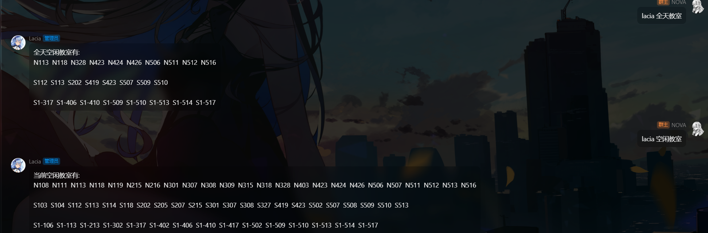

  
   
  

# BUPT-Rest-Classrooms

_✨ 简单的 空闲教室 获取方案 ✨_

## 📖 介绍

使用企业微信微教学来看空闲教室实在是不够养眼，想要泡在教室一天？人工取并集的你（其实是我）真的很狼狈。于是这个功能出现了，在小群内用了很久之后决定发出来。

### 如何做到
抓一下路由看 API，逆一下 webpack 看登录，解决了

接着大量使用~~丑陋难读~~美观简洁的 Python 内置函数对时间进行处理分片打包

### 特点
- [X] ~~获取特定时间的空闲教室~~好吧看了下代码好像没写特定时间，不过改起来很容易，自己动手丰衣足食（然后大概 beautifier 也要改改）
- [X] 获取全天空闲教室（从~~指定时间~~调用时开始到当天晚上截止都为空闲的教室）
- [X] 不太优雅的 JSON 缓存机制
- [X] 异步解决方案，自动登录
- [X] 可获取不同校区（因为群友都是网安的，全在沙河，所以 bot 没写本部的，可以通过 `get_content(..., shahe=False)` 指定本部，懒得写了）

## 💿 安装

懒得打包了，就这样吧

需要 `aiohttp`，`pydantic`，`pycryptodome` 和 `urllib`，因为自己 bot 有这些所以就直接用了，如果单纯的作为一个空闲教室解决方案可能会显得臃肿。

从 github 安装

在 Nonebot 项目的插件目录下, 打开命令行, 输入以下命令克隆此储存库

    git clone https://github.com/Nova-Noir/BUPT-Rest-Classrooms.git

打开 Nonebot 项目的 `bot.py` 文件, 在其中写入

    nonebot.load_plugin('src.plugins.BUPT-Rest-Classrooms')

## ⚙️ 配置

在 Nova-Bot 项目的`.env`文件中添加下表中的必填配置

| 配置项  | 必填 | 默认值 |   说明   |
| :-----: | :--: | :----: | :------: |
| BUPT_USERNO |  是  |   无   | 学号 |
| BUPT_PWD |  是 |   无   | 教务管理微信的密码（大概和教务管理一样吧） |

## 🎉 使用

### 指令表

| 指令  | 权限 | 需要@ | 范围 |   说明   |
| :---: | :--: | :---: | :--: | :------: |
| 全天教室 | 群员 |  是   | 群聊 | 获取全天教室，别称：全天空闲教室 |
| 空闲教室 | 群员 |  是   | 群聊 | 获取当前空闲教室 |

### 效果图

